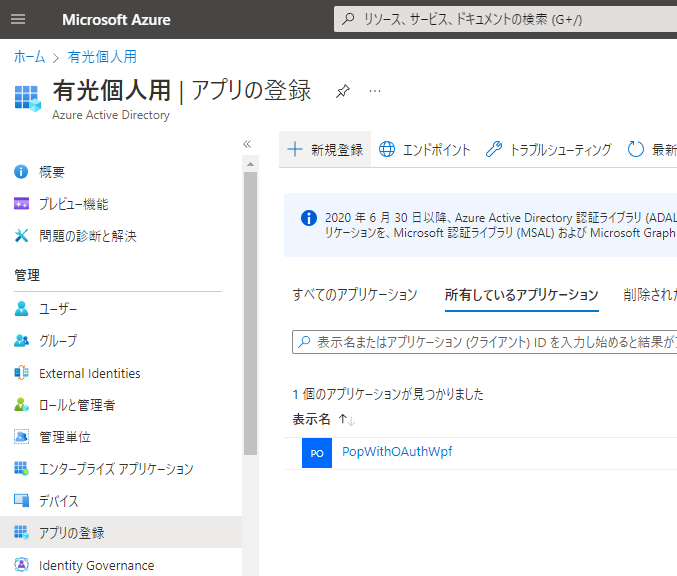
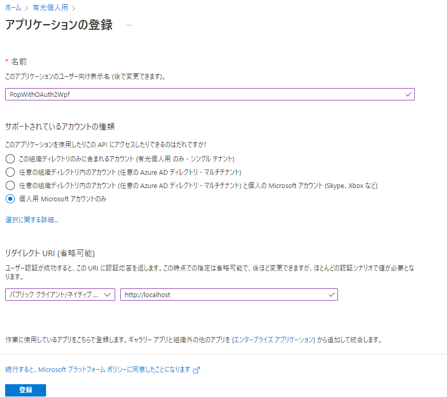
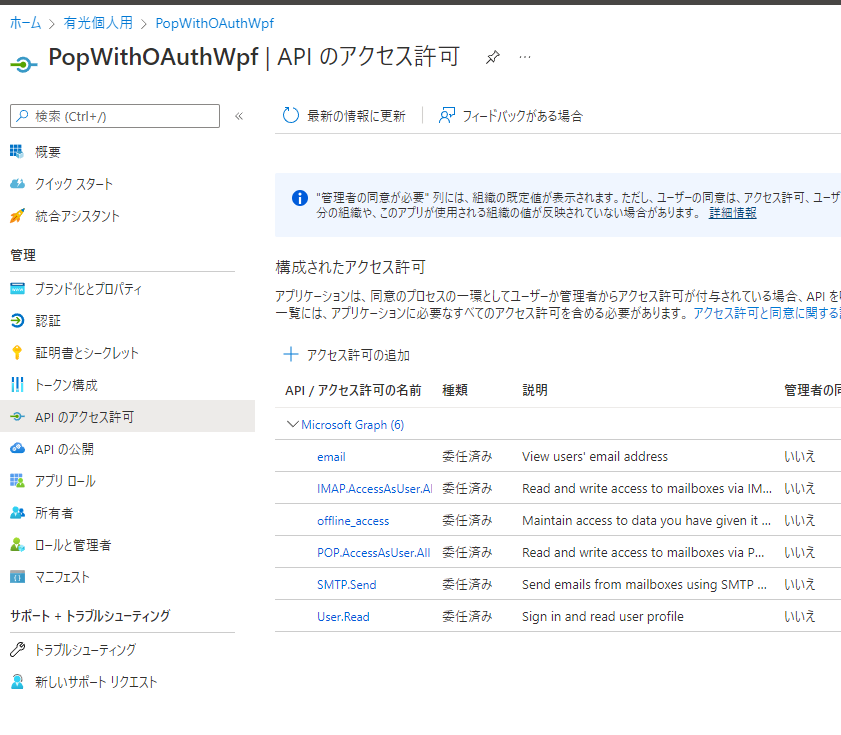
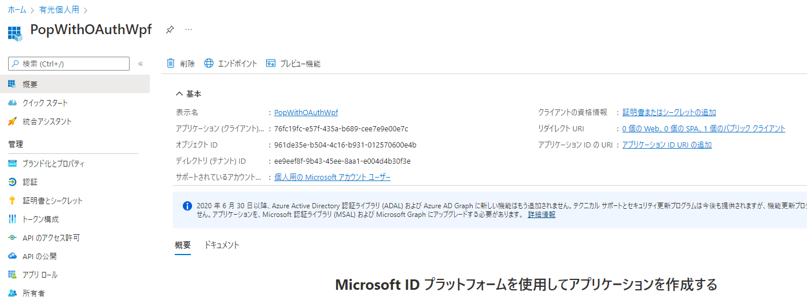
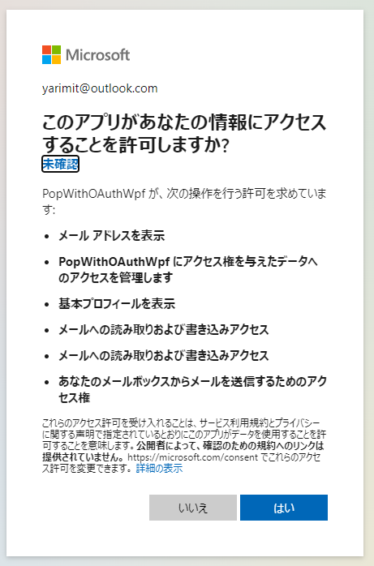
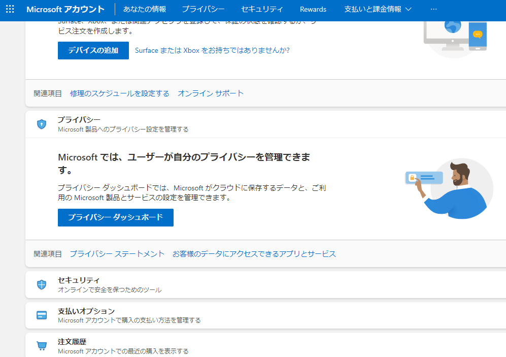
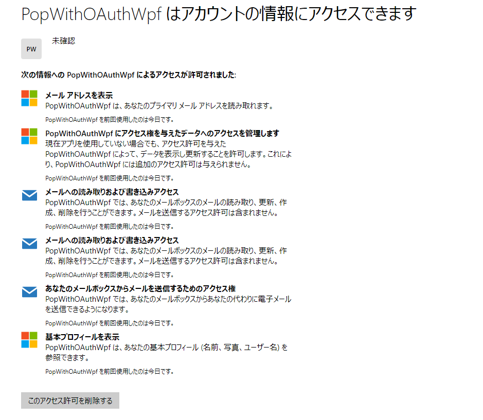

# Exchange (Office365/outlook.com・HotMail 系)

## Azure Portal 操作

1. [Azure Portal](https://portal.azure.com) にサインインし、アプリを登録する AzureAD を選択する

2. 「アプリの登録」を開き、「新規登録」を押す

   

3. アプリケーションの基本情報を設定する

   

   - アプリ名は自由
   - サポートされているアカウントの種類

     - outlook.com のユーザを対象としたい場合は「個人用 Microsoft アカウントのみ」

   - リダイレクト URI は「パブリッククライアント／ネイティブ」を選択し、URL に「http://localhost」を記入

4. 作成したアプリケーションを選択し、「API のアクセス許可」を開き、アクセス許可を追加する。

   

   - User.Read はデフォルトで入っている
   - email, offline_access を追加
   - SMTP/POP/IMAP は利用するプロトコルのものを追加する

5. 作成したアプリケーションの「概要」を開き、クライアント ID・テナント ID をメモしておく。

   

## サンプルアプリ

[App.xaml.cs の Exchange OAuth 認証設定部分](App.xaml.cs#L43-L58) に作成したクライアント ID・テナント ID・スコープを設定し、実行する。

「Exchange」ボタンを押すとブラウザで OAuth 同意ページが開き、続行ボタンを押すと許可が与えられ、POP でログイン・メールボックスにアクセスする。

(\*) メールアカウント側で POP3 によるアクセスを有効化しておかなければなりません

### Office365/個人アカウントによるテナント設定の変更点

テナント ID は Office365 の場合テナント ID、個人 MS アカウント(outlook.com)なら 「consumer」とする。

Office365 の場合、スコープを https://outlook.office365.com/* に変更しなくてはならないという [情報](https://sumomo.ohwaki.jp/wordpress/?p=218) あり。

### アクセス許可の取り消し

1. Microsoft アカウントのアカウント管理ページを開き、「プライバシー」の「お客様のデータにアクセスできるアプリとサービス」を選択します。

2. アプリの一覧が表示されるので、削除したいアプリを開き、「このアクセス許可を削除する」を押します。

## 参考リンク

- [OAuth を使用して IMAP、POP、SMTP 接続を認証する](https://docs.microsoft.com/ja-jp/exchange/client-developer/legacy-protocols/how-to-authenticate-an-imap-pop-smtp-application-by-using-oauth)
- [Microsoft ID プラットフォームにアプリケーションを登録する](https://docs.microsoft.com/en-us/azure/active-directory/develop/quickstart-register-app)
- [MailKit の Exchange OAuth2 設定手順](https://github.com/jstedfast/MailKit/blob/master/ExchangeOAuth2.md)
