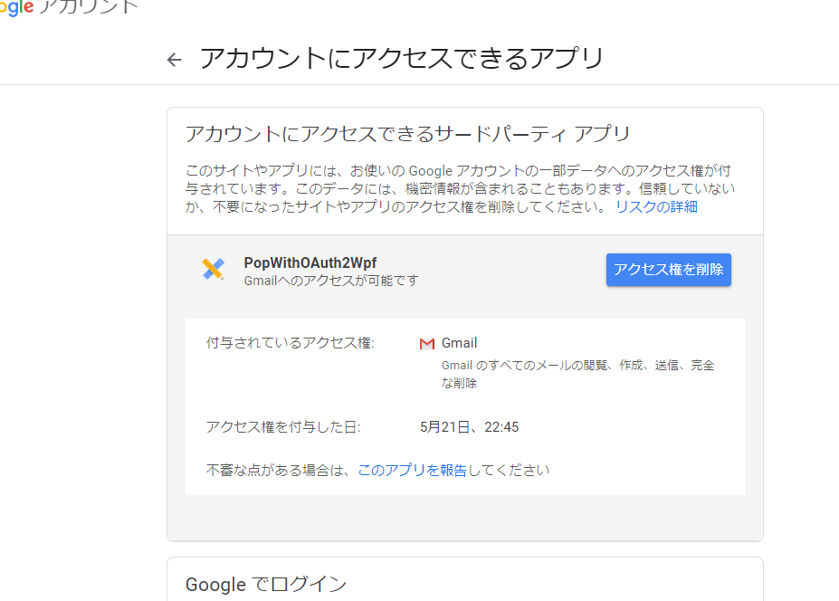

# Gmail (Google Workspace/gmail 系)

## Google Developer Console 操作

1. [Google Developer Console](https://console.cloud.google.com/) にログインし、新規プロジェクトを作成する。

2. プロジェクトを開き、「API とサービス」から「Gmail API」を有効化する。

   

3. 「OAuth 同意画面」を選択し、必要な情報を入力する。

   1. UserType は外部を選択

      

   2. アプリ情報は適当で OK

      

   3. スコープでは GMail を追加しておく

      

   4. テストユーザーにテストで使用するユーザのアカウントを追加しておく

      

      (\*) Google workspace なら UserType を組織向けにする(はず)  
      (\*) テスト状態だとテストユーザでしかログインできない

4. 「認証情報」を選択し、「OAuth クライアント ID」を作成する。

   

   1. アプリケーションの種類は「デスクトップ アプリ」を選択

   2. クライアント ID・シークレットが生成されるのでメモっておく

      

## サンプルアプリ

[App.xaml.cs の Google OAuth 認証設定部分](App.xaml.cs#L30-L41) に作成したクライアント ID・シークレット・スコープを設定し、実行する。

「Gmail」ボタンを押すとブラウザで OAuth 同意ページが開き、続行ボタンを押すと許可が与えられ、POP でログイン・メールボックスにアクセスする。

(\*) メールアカウント側で POP3 によるアクセスを有効化しておかなければなりません
(\*) トークンはローカルに保存される為、二度目以降は同意画面は開きません。トークンキャッシュのパスは %HOME%\\AppData\\Roaming\\CredentialCacheFolder あたりになります。ファイルを削除すると次回また OAuth 同意が必要になります。

### アクセス許可の取り消し

1. Google のアカウント管理ページを開き、「データとプライバシー」から「アカウントにアクセスできるサードパーティアプリ」を開きます。

2. 許可を与えたアプリが表示されるので、権限を削除したいアプリの「アクセス権を削除」を押します。

## 参考リンク

- [OAuth 2.0 を使用した Google API へのアクセス](https://developers.google.com/identity/protocols/oauth2)
- [MailKit の Gmail OAuth2 設定手順](https://github.com/jstedfast/MailKit/blob/master/GMailOAuth2.md)
